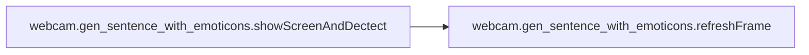
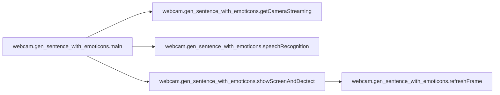

# Webcam Gen Sentence With Emoticons

[_Documentation generated by Documatic_](https://www.documatic.com)

<!---Documatic-section-Codebase Structure-start--->
## Codebase Structure

<!---Documatic-block-system_architecture-start--->
```mermaid
None
```
<!---Documatic-block-system_architecture-end--->

# #
<!---Documatic-section-Codebase Structure-end--->

<!---Documatic-section-webcam.gen_sentence_with_emoticons.speechRecognition-start--->
## webcam.gen_sentence_with_emoticons.speechRecognition

<!---Documatic-section-speechRecognition-start--->
<!---Documatic-block-webcam.gen_sentence_with_emoticons.speechRecognition-start--->
<details>
	<summary><code>webcam.gen_sentence_with_emoticons.speechRecognition</code> code snippet</summary>

```python
def speechRecognition():
    print("Press 'y' to start~")
    inputdata = input()
    if inputdata == 'y':
        inputdata = 0
        r = sr.Recognizer()
        with sr.Microphone() as source:
            print('Say something!')
            audio = r.listen(source)
        try:
            recSuccess = 1
            recContent = r.recognize_google(audio)
            print('Speech Recognition thinks you said ' + recContent)
            return recContent
        except sr.UnknownValueError:
            print('Could not understand audio')
        except sr.RequestError as e:
            print('Could not request results from Google Speech Recognition service; {0}'.format(e))
```
</details>
<!---Documatic-block-webcam.gen_sentence_with_emoticons.speechRecognition-end--->
<!---Documatic-section-speechRecognition-end--->

# #
<!---Documatic-section-webcam.gen_sentence_with_emoticons.speechRecognition-end--->

<!---Documatic-section-webcam.gen_sentence_with_emoticons.refreshFrame-start--->
## webcam.gen_sentence_with_emoticons.refreshFrame

<!---Documatic-section-refreshFrame-start--->
<!---Documatic-block-webcam.gen_sentence_with_emoticons.refreshFrame-start--->
<details>
	<summary><code>webcam.gen_sentence_with_emoticons.refreshFrame</code> code snippet</summary>

```python
def refreshFrame(frame, faceCoordinates):
    if faceCoordinates is not None:
        fdu.drawFace(frame, faceCoordinates)
    cv2.imshow(windowsName, frame)
```
</details>
<!---Documatic-block-webcam.gen_sentence_with_emoticons.refreshFrame-end--->
<!---Documatic-section-refreshFrame-end--->

# #
<!---Documatic-section-webcam.gen_sentence_with_emoticons.refreshFrame-end--->

<!---Documatic-section-webcam.gen_sentence_with_emoticons.showScreenAndDectect-start--->
## webcam.gen_sentence_with_emoticons.showScreenAndDectect

<!---Documatic-section-showScreenAndDectect-start--->


### Object Calls

* webcam.gen_sentence_with_emoticons.refreshFrame

<!---Documatic-block-webcam.gen_sentence_with_emoticons.showScreenAndDectect-start--->
<details>
	<summary><code>webcam.gen_sentence_with_emoticons.showScreenAndDectect</code> code snippet</summary>

```python
def showScreenAndDectect(capture):
    print('Face dececting...')
    cnt = 5
    while cnt:
        (flag, frame) = capture.read()
        faceCoordinates = fdu.getFaceCoordinates(frame)
        refreshFrame(frame, faceCoordinates)
        if faceCoordinates is not None:
            cnt -= 1
            face_img = fdu.preprocess(frame, faceCoordinates, face_shape=FACE_SHAPE)
            input_img = np.expand_dims(face_img, axis=0)
            input_img = np.expand_dims(input_img, axis=0)
            result = model.predict(input_img)[0]
            if cnt == 4:
                tot_result = result
            else:
                tot_result += result
            index = np.argmax(result)
            print('Frame', 5 - cnt, ':', emo[index], 'prob:', max(result))
    index = np.argmax(tot_result)
    print('Final decision:', emo[index], 'prob:', max(tot_result))
    return emo[index]
```
</details>
<!---Documatic-block-webcam.gen_sentence_with_emoticons.showScreenAndDectect-end--->
<!---Documatic-section-showScreenAndDectect-end--->

# #
<!---Documatic-section-webcam.gen_sentence_with_emoticons.showScreenAndDectect-end--->

<!---Documatic-section-webcam.gen_sentence_with_emoticons.getCameraStreaming-start--->
## webcam.gen_sentence_with_emoticons.getCameraStreaming

<!---Documatic-section-getCameraStreaming-start--->
<!---Documatic-block-webcam.gen_sentence_with_emoticons.getCameraStreaming-start--->
<details>
	<summary><code>webcam.gen_sentence_with_emoticons.getCameraStreaming</code> code snippet</summary>

```python
def getCameraStreaming():
    capture = cv2.VideoCapture(0)
    if not capture:
        print('Failed to capture video streaming ')
        sys.exit(1)
    else:
        print('Successed to capture video streaming')
    return capture
```
</details>
<!---Documatic-block-webcam.gen_sentence_with_emoticons.getCameraStreaming-end--->
<!---Documatic-section-getCameraStreaming-end--->

# #
<!---Documatic-section-webcam.gen_sentence_with_emoticons.getCameraStreaming-end--->

<!---Documatic-section-webcam.gen_sentence_with_emoticons.main-start--->
## webcam.gen_sentence_with_emoticons.main

<!---Documatic-section-main-start--->


### Object Calls

* webcam.gen_sentence_with_emoticons.getCameraStreaming
* webcam.gen_sentence_with_emoticons.speechRecognition
* webcam.gen_sentence_with_emoticons.showScreenAndDectect

<!---Documatic-block-webcam.gen_sentence_with_emoticons.main-start--->
<details>
	<summary><code>webcam.gen_sentence_with_emoticons.main</code> code snippet</summary>

```python
def main():
    print('Enter main() function')
    capture = getCameraStreaming()
    cv2.startWindowThread()
    cv2.namedWindow(windowsName, cv2.WND_PROP_FULLSCREEN)
    cv2.setWindowProperty(windowsName, cv2.WND_PROP_FULLSCREEN, cv2.WND_PROP_FULLSCREEN)
    while True:
        recContent = speechRecognition()
        if recContent is not None:
            emotion = showScreenAndDectect(capture)
            if emotion == 'Angry':
                emoji = ' >:O'
            elif emotion == 'Fear':
                emoji = ' :-S'
            elif emotion == 'Happy':
                emoji = ' :-D'
            elif emotion == 'Sad':
                emoji = " :'("
            elif emotion == 'Surprise':
                emoji = ' :-O'
            else:
                emoji = ' '
            print('Output result: ' + recContent + emoji)
```
</details>
<!---Documatic-block-webcam.gen_sentence_with_emoticons.main-end--->
<!---Documatic-section-main-end--->

# #
<!---Documatic-section-webcam.gen_sentence_with_emoticons.main-end--->

[_Documentation generated by Documatic_](https://www.documatic.com)