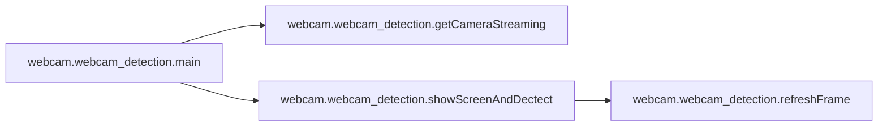

# Webcam Webcam Detection

[_Documentation generated by Documatic_](https://www.documatic.com)

<!---Documatic-section-Codebase Structure-start--->
## Codebase Structure

<!---Documatic-block-system_architecture-start--->
```mermaid
None
```
<!---Documatic-block-system_architecture-end--->

# #
<!---Documatic-section-Codebase Structure-end--->

<!---Documatic-section-webcam.webcam_detection.refreshFrame-start--->
## webcam.webcam_detection.refreshFrame

<!---Documatic-section-refreshFrame-start--->
<!---Documatic-block-webcam.webcam_detection.refreshFrame-start--->
<details>
	<summary><code>webcam.webcam_detection.refreshFrame</code> code snippet</summary>

```python
def refreshFrame(frame, faceCoordinates):
    if faceCoordinates is not None:
        fdu.drawFace(frame, faceCoordinates)
    cv2.imshow(windowsName, frame)
```
</details>
<!---Documatic-block-webcam.webcam_detection.refreshFrame-end--->
<!---Documatic-section-refreshFrame-end--->

# #
<!---Documatic-section-webcam.webcam_detection.refreshFrame-end--->

<!---Documatic-section-webcam.webcam_detection.showScreenAndDectect-start--->
## webcam.webcam_detection.showScreenAndDectect

<!---Documatic-section-showScreenAndDectect-start--->


### Object Calls

* webcam.webcam_detection.refreshFrame

<!---Documatic-block-webcam.webcam_detection.showScreenAndDectect-start--->
<details>
	<summary><code>webcam.webcam_detection.showScreenAndDectect</code> code snippet</summary>

```python
def showScreenAndDectect(capture):
    while True:
        (flag, frame) = capture.read()
        faceCoordinates = fdu.getFaceCoordinates(frame)
        refreshFrame(frame, faceCoordinates)
        if faceCoordinates is not None:
            face_img = fdu.preprocess(frame, faceCoordinates, face_shape=FACE_SHAPE)
            input_img = np.expand_dims(face_img, axis=0)
            input_img = np.expand_dims(input_img, axis=0)
            result = model.predict(input_img)[0]
            index = np.argmax(result)
            print(emo[index], 'prob:', max(result))
```
</details>
<!---Documatic-block-webcam.webcam_detection.showScreenAndDectect-end--->
<!---Documatic-section-showScreenAndDectect-end--->

# #
<!---Documatic-section-webcam.webcam_detection.showScreenAndDectect-end--->

<!---Documatic-section-webcam.webcam_detection.getCameraStreaming-start--->
## webcam.webcam_detection.getCameraStreaming

<!---Documatic-section-getCameraStreaming-start--->
<!---Documatic-block-webcam.webcam_detection.getCameraStreaming-start--->
<details>
	<summary><code>webcam.webcam_detection.getCameraStreaming</code> code snippet</summary>

```python
def getCameraStreaming():
    capture = cv2.VideoCapture(0)
    if not capture:
        print('Failed to capture video streaming ')
        sys.exit(1)
    else:
        print('Successed to capture video streaming')
    return capture
```
</details>
<!---Documatic-block-webcam.webcam_detection.getCameraStreaming-end--->
<!---Documatic-section-getCameraStreaming-end--->

# #
<!---Documatic-section-webcam.webcam_detection.getCameraStreaming-end--->

<!---Documatic-section-webcam.webcam_detection.main-start--->
## webcam.webcam_detection.main

<!---Documatic-section-main-start--->


### Object Calls

* webcam.webcam_detection.getCameraStreaming
* webcam.webcam_detection.showScreenAndDectect

<!---Documatic-block-webcam.webcam_detection.main-start--->
<details>
	<summary><code>webcam.webcam_detection.main</code> code snippet</summary>

```python
def main():
    print('Enter main() function')
    if args.testImage is not None:
        img = cv2.imread(args.testImage)
        img = cv2.cvtColor(img, cv2.COLOR_BGR2GRAY)
        img = cv2.resize(img, FACE_SHAPE)
        print(class_label[result[0]])
        sys.exit(0)
    showCam = 1
    capture = getCameraStreaming()
    if showCam:
        cv2.startWindowThread()
        cv2.namedWindow(windowsName, cv2.WND_PROP_FULLSCREEN)
        cv2.setWindowProperty(windowsName, cv2.WND_PROP_FULLSCREEN, cv2.WND_PROP_FULLSCREEN)
    showScreenAndDectect(capture)
```
</details>
<!---Documatic-block-webcam.webcam_detection.main-end--->
<!---Documatic-section-main-end--->

# #
<!---Documatic-section-webcam.webcam_detection.main-end--->

[_Documentation generated by Documatic_](https://www.documatic.com)